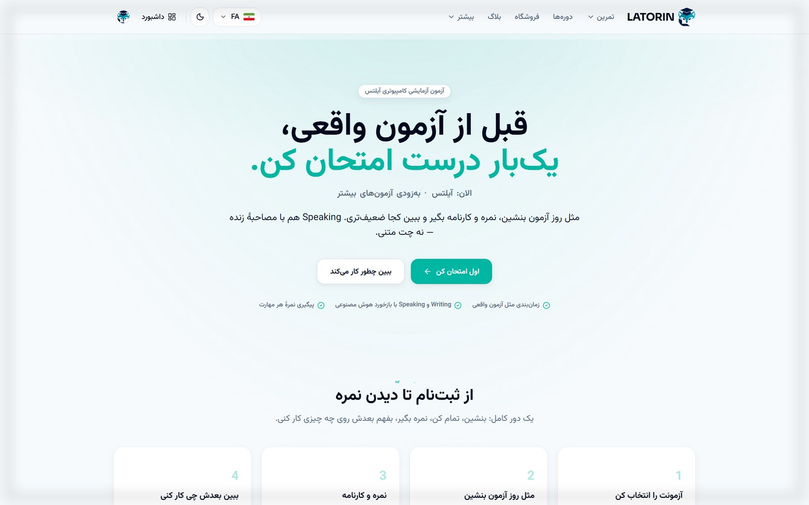
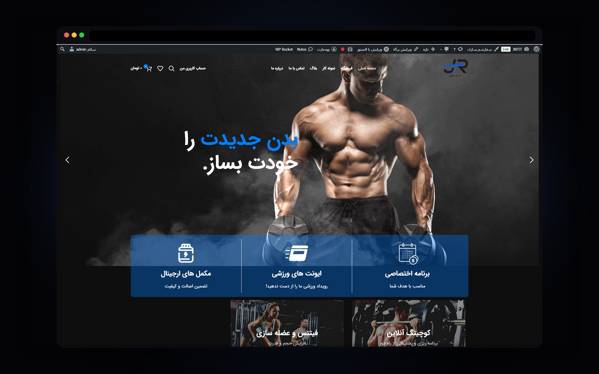
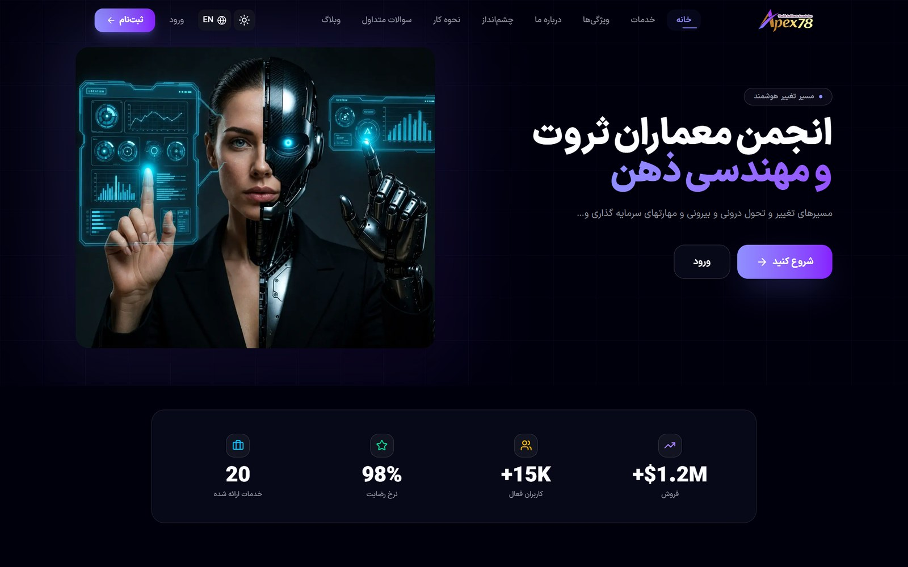
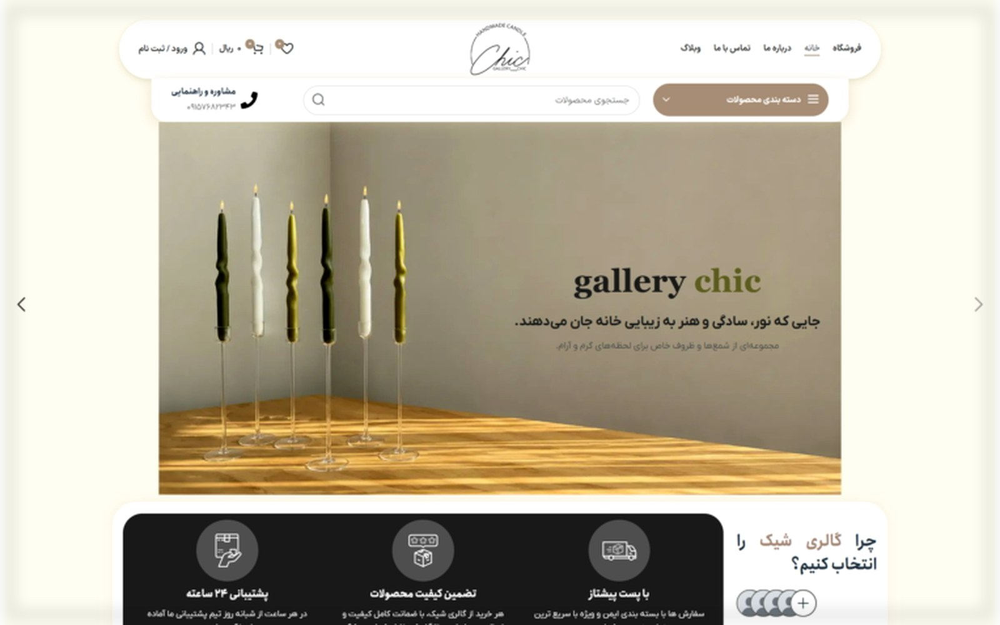

# Younes Kazemi — Portfolio

<p align="center">
  <strong>Full-stack Web Developer</strong><br/>
  WordPress shops · Custom Next.js + Django · Clean modern UI
</p>

<p align="center">
  <a href="https://youneskazemi.vercel.app"></a>
  <a href="https://youneskazemi.ir"></a>
  <a href="https://nextjs.org"></a>
  <a href="https://tailwindcss.com"></a>
  <a href="https://www.framer.com/motion/"></a>
</p>

<p align="center">
  <a href="https://youneskazemi.ir">🌐 Live site</a>
  ·
  <a href="#-portfolio">Projects</a>
  ·
  <a href="#-getting-started">Getting started</a>
  ·
  <a href="#-contact">Contact</a>
</p>

---

## Overview

Personal freelance portfolio for **Younes Kazemi (سیدیونس کاظمی)** — built to showcase real client work and convert visitors from Karlancer / direct outreach into phased projects.

<p align="center">
  
</p>

**Brand mark:** geometric **YK** monogram (SVG) — sky cyan on dark. Used in nav, favicon (`app/icon.svg`), and Open Graph card.

| | |
|---|---|
| **Role** | Full-stack web developer |
| **Focus** | Company sites, WooCommerce shops, custom Next.js + Django products |
| **Languages** | فارسی (default) · English |
| **Host** | [Vercel](https://vercel.com) |
| **Domain** | [youneskazemi.ir](https://youneskazemi.ir) · [youneskazemi.vercel.app](https://youneskazemi.vercel.app) |

### Highlights

- Dark, premium single-page home + full **`/projects`** catalog with filters
- **FA-first RTL** layout with instant **EN / FA** toggle
- Hero **recent-projects slider**, home shows **3 case studies**, rest on All work
- Browser-framed covers from real screenshots (`public/projects/covers/`)
- Scroll parallax, progress bar, ambient depth (Framer Motion) — respects `prefers-reduced-motion`
- Content-driven — edit TypeScript data files, not hard-coded pages
- FA-first SEO: metadata, OG/Twitter, JSON-LD, sitemap, robots
- Static-friendly Next.js App Router · continuous deploy on Vercel

---

## Portfolio

Catalog order (home showcase = first **3**):

| Project | Type | Live |
|---------|------|------|
| **[Latorin](https://latorin.ir)** | Custom web / platform | [latorin.ir](https://latorin.ir) |
| **[JR Fit](https://jrfit.ir)** | WordPress · fitness store | [jrfit.ir](https://jrfit.ir) |
| **[AV Cafe Bakery](https://avcafebakery.vercel.app/)** | Cafe / bakery brand site (FA) | [avcafebakery.vercel.app](https://avcafebakery.vercel.app/) |
| **[Apex78](https://apex78.org)** | Association / content | [apex78.org](https://apex78.org) |
| **[Gallery Chiic](https://gallerychiic.com)** | Gallery / storefront | [gallerychiic.com](https://gallerychiic.com) |
| **[TickTOM](https://t.me/TiCkTOM_bot)** | Telegram mini app / game | [t.me/TiCkTOM_bot](https://t.me/TiCkTOM_bot) |
| **[Rimel Cosmetics](https://rimelcosmetics.ir)** | WordPress · WooCommerce | [rimelcosmetics.ir](https://rimelcosmetics.ir) |
| **[Rayan AI](https://rayanai.io)** | AI product / SaaS | [rayanai.io](https://rayanai.io) |
| **[Cadinu Apps](https://apps.cadinu.io/)** | DeFi / Web3 dApp hub | [apps.cadinu.io](https://apps.cadinu.io/) |

<p align="center">
  
  
</p>
<p align="center">
  
  
</p>

> Covers are generated from full-page screenshots in `public/projects/project_png_raw/` via `scripts/make_showcase_covers.py`. See [`docs/COVER-PROMPT.md`](docs/COVER-PROMPT.md).

---

## Stack

| Layer | Choice |
|-------|--------|
| Framework | [Next.js 16](https://nextjs.org) (App Router) |
| Language | TypeScript |
| Styling | [Tailwind CSS v4](https://tailwindcss.com) |
| Motion | [Framer Motion](https://www.framer.com/motion/) |
| Fonts | Vazirmatn · Inter (`next/font`) |
| Deploy | Vercel |

---

## Site map

```text
/                       Home (anchor sections)
/projects               Full catalog + filters
/projects/[slug]        Case study per project
/sitemap.xml            Sitemap
/robots.txt             Robots
```

### Home sections

1. **Hero** — name, role, CTAs, recent-work slider  
2. **Selected work** — 3 featured case studies → link to All work  
3. **Skills** — frontend · backend · CMS · other  
4. **Services** — WordPress / Woo vs custom Next + Django  
5. **Process** — scope → build → deliver  
6. **About** — short bio  
7. **Contact** — Telegram · email  

---

## Project structure

```text
app/
  layout.tsx                 # fonts, metadata, providers
  page.tsx                   # home
  opengraph-image.tsx        # dynamic OG (fallback)
  twitter-image.tsx
  projects/page.tsx          # full catalog
  projects/[slug]/page.tsx   # case study
  globals.css                # tokens, buttons, a11y focus
components/                  # UI + motion
content/
  site.ts                    # profile, copy, skills, services, process
  projects.ts                # portfolio data + order + HOME_SHOWCASE_COUNT
lib/
  i18n.tsx                   # FA / EN language context
  seo.ts                     # titles, JSON-LD helpers
public/
  og.png                     # share card (scrapers)
  logo.svg · favicons
  projects/
    covers/                  # 16:10 showcase JPGs (used on site)
    project_png_raw/         # full-page source screenshots
scripts/
  make_showcase_covers.py    # raw PNG → polished cover JPG
  make_covers.py             # alternate cover helper
docs/
  COVER-PROMPT.md            # image / cover workflow notes
```

---

## Getting started

### Requirements

- Node.js 20+ recommended  
- npm (or pnpm / yarn)  
- Optional: Python 3 + Pillow for cover generation

### Install & run

```bash
git clone https://github.com/youneskazemi/youneskazemi.git
cd youneskazemi
npm install
npm run dev
```

Open [http://localhost:3000](http://localhost:3000).

### Scripts

| Command | Description |
|---------|-------------|
| `npm run dev` | Development server |
| `npm run build` | Production build |
| `npm run start` | Serve production build |
| `npm run lint` | ESLint |
| `python scripts/make_showcase_covers.py` | Rebuild cover JPGs from raw screenshots |

---

## SEO & share

- Default locale **fa-IR**; bilingual content via client toggle  
- Metadata, Open Graph, Twitter cards, JSON-LD (`Person` + `WebSite` + projects)  
- Static share image: [`public/og.png`](public/og.png) (reliable for Telegram / WhatsApp)  
- [`/sitemap.xml`](https://youneskazemi.ir/sitemap.xml) · [`/robots.txt`](https://youneskazemi.ir/robots.txt)  
- Canonical base: `https://youneskazemi.ir` (see `lib/seo.ts` / `content/site.ts`)

---

## Customize content

| File | What to edit |
|------|----------------|
| [`content/site.ts`](content/site.ts) | Name, email, Telegram, FA/EN copy, skills, services, process, about |
| [`content/projects.ts`](content/projects.ts) | Projects, live URLs, tags, stack, bodies, `recentSlugs`, `HOME_SHOWCASE_COUNT` |
| [`public/projects/covers/`](public/projects/covers/) | Showcase images shown on the site |
| [`public/projects/project_png_raw/`](public/projects/project_png_raw/) | Source full-page screenshots |
| [`docs/COVER-PROMPT.md`](docs/COVER-PROMPT.md) | Cover generation notes |

### Contact fields

In `content/site.ts`:

```ts
email: "youneskazemi9798@gmail.com",
telegram: "https://t.me/younes_kzi",
telegramHandle: "@younes_kzi",
```

### Add a project

1. Save a full-page PNG in `public/projects/project_png_raw/`.  
2. Add an entry in `scripts/make_showcase_covers.py` and run it (or place a JPG under `public/projects/covers/`).  
3. Append an object to `projects` in `content/projects.ts` (`image: "/projects/covers/<slug>.jpg"`).  
4. Add the slug to `recentSlugs` if it should appear in catalog order / hero.  
5. Deploy — detail route is generated from `slug`.

### Home showcase count

```ts
// content/projects.ts
export const HOME_SHOWCASE_COUNT = 3;
```

---

## Deploy (Vercel)

Continuous deploy from `master` → [youneskazemi.vercel.app](https://youneskazemi.vercel.app).

1. Push to GitHub.  
2. Import / keep the project on [Vercel](https://vercel.com/new).  
3. Framework preset: **Next.js** (auto-detected).  
4. Attach domain **youneskazemi.ir**:

| Type | Name | Value |
|------|------|--------|
| A | `@` | `76.76.21.21` |
| CNAME | `www` | `cname.vercel-dns.com` |

Remove old A records that still point at previous hosting.

---

## Design notes

- **Theme:** dark portfolio (`#050508` base, sky `#38bdf8` accent)  
- **UI system:** shared tokens + `.btn-primary` / `.btn-secondary` / `.surface-card` in `app/globals.css`  
- **A11y:** focus rings, ≥44px touch targets on primary controls, reduced-motion kill-switch  
- **Motion:** scroll progress, parallax, hero mouse depth, in-view reveals  
- **i18n:** client FA/EN toggle with `dir="rtl"` / `ltr` on `<html>`  
- **Not included (on purpose):** auth, CMS, blog, Django on this app — showcase only  

Optional later: `$impeccable init` for `PRODUCT.md` / `DESIGN.md` if you want locked design context.

---

## Contact

| | |
|---|---|
| **Telegram** | [@younes_kzi](https://t.me/younes_kzi) |
| **Email** | [youneskazemi9798@gmail.com](mailto:youneskazemi9798@gmail.com) |
| **Portfolio** | [youneskazemi.ir](https://youneskazemi.ir) · [youneskazemi.vercel.app](https://youneskazemi.vercel.app) |

Available for freelance projects · clear phases · staged delivery.

---

## License

Private portfolio source. All rights reserved unless otherwise noted.  
Client project brands and trademarks belong to their respective owners.

---

<p align="center">
  Built with Next.js · Tailwind · Framer Motion · Deployed on Vercel
</p>
