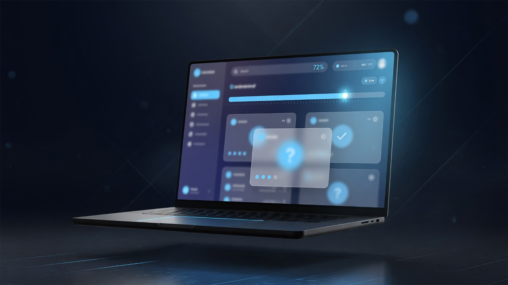
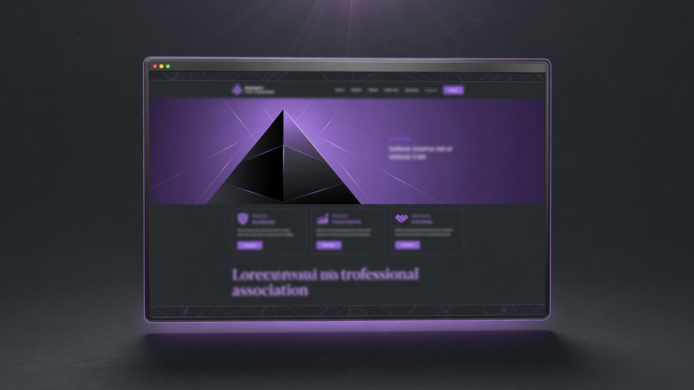
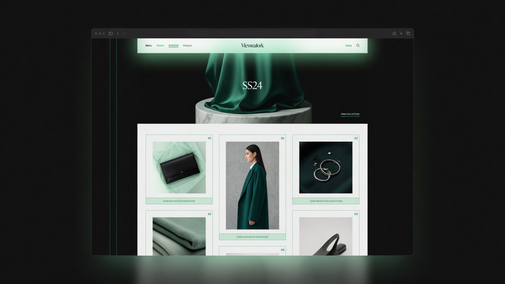
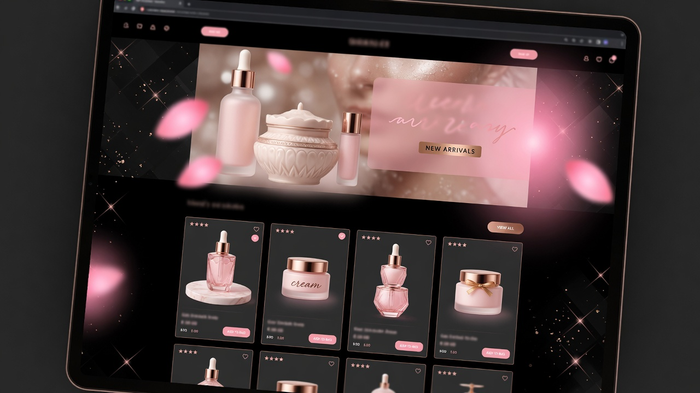

# Younes Kazemi — Portfolio

<p align="center">
  <strong>Full-stack Web Developer</strong><br/>
  WordPress shops · Custom Next.js + Django · Clean modern UI
</p>

<p align="center">
  <a href="https://youneskazemi.vercel.app"></a>
  <a href="https://youneskazemi.ir"></a>
  <a href="https://nextjs.org"></a>
  <a href="https://tailwindcss.com"></a>
  <a href="https://www.framer.com/motion/"></a>
</p>

<p align="center">
  <a href="https://youneskazemi.vercel.app">🌐 Live site</a>
  ·
  <a href="#-featured-work">Projects</a>
  ·
  <a href="#-getting-started">Getting started</a>
  ·
  <a href="#-contact">Contact</a>
</p>

---

## Overview

Personal freelance portfolio for **Younes Kazemi (سیدیونس کاظمی)** — built to showcase real client work and convert visitors from Karlancer / direct outreach into phased projects.

| | |
|---|---|
| **Role** | Full-stack web developer |
| **Focus** | Company sites, WooCommerce shops, custom Next.js + Django products |
| **Languages** | فارسی (default) · English |
| **Host** | [Vercel](https://vercel.com) |
| **Domain** | [youneskazemi.ir](https://youneskazemi.ir) · [youneskazemi.vercel.app](https://youneskazemi.vercel.app) |

### Highlights

- Dark, modern single-page portfolio with anchor sections
- **FA-first RTL** layout with instant **EN / FA** toggle
- Scroll parallax, progress bar, ambient depth (Framer Motion)
- Content-driven — edit TypeScript data files, not hard-coded pages
- Static-friendly Next.js App Router · ready for Vercel + custom domain

---

## Featured work

| Project | Type | Live |
|---------|------|------|
| **[Latorin](https://latorin.ir)** | Custom web / platform | [latorin.ir](https://latorin.ir) |
| **[Apex78](https://apex78.org)** | Association / content site | [apex78.org](https://apex78.org) |
| **[Rimel Cosmetics](https://rimelcosmetics.ir)** | WordPress · WooCommerce store | [rimelcosmetics.ir](https://rimelcosmetics.ir) |
| **[Gallery Chiic](https://gallerychiic.com)** | Gallery / storefront | [gallerychiic.com](https://gallerychiic.com) |

<p align="center">
  
  
</p>
<p align="center">
  
  
</p>

> Cover images are design placeholders until replaced with real product screenshots in `public/projects/`.

---

## Stack

| Layer | Choice |
|-------|--------|
| Framework | [Next.js 16](https://nextjs.org) (App Router) |
| Language | TypeScript |
| Styling | [Tailwind CSS v4](https://tailwindcss.com) |
| Motion | [Framer Motion](https://www.framer.com/motion/) |
| Fonts | Vazirmatn · Inter (`next/font`) |
| Deploy | Vercel |

---

## Site map

```text
/                       Home (all sections as anchors)
/projects/[slug]        Short case study per project
```

### Home sections

1. **Hero** — name, role, CTAs  
2. **Selected work** — project cards  
3. **Skills** — frontend · backend · CMS · other  
4. **Services** — WordPress / Woo vs custom Next + Django  
5. **Process** — scope → build → deliver  
6. **About** — short bio  
7. **Contact** — Telegram · email  

---

## Project structure

```text
app/
  layout.tsx              # fonts, metadata, providers
  page.tsx                # home
  projects/[slug]/page.tsx
  globals.css
components/               # UI + motion
content/
  site.ts                 # profile, copy, skills, services, process
  projects.ts             # portfolio data
lib/
  i18n.tsx                # FA / EN language context
public/
  projects/               # cover images (JPG)
```

---

## Getting started

### Requirements

- Node.js 20+ recommended  
- npm (or pnpm / yarn)

### Install & run

```bash
git clone https://github.com/youneskazemi/youneskazemi.git
cd youneskazemi
npm install
npm run dev
```

Open [http://localhost:3000](http://localhost:3000).

### Scripts

| Command | Description |
|---------|-------------|
| `npm run dev` | Development server |
| `npm run build` | Production build |
| `npm run start` | Serve production build |
| `npm run lint` | ESLint |

---

## Customize content

| File | What to edit |
|------|----------------|
| [`content/site.ts`](content/site.ts) | Name, email, Telegram, FA/EN copy, skills, services, process, about |
| [`content/projects.ts`](content/projects.ts) | Project titles, links, tags, summaries, case study body |
| [`public/projects/`](public/projects/) | Cover images (`latorin.jpg`, `apex78.jpg`, `rimel.jpg`, `gallerychiic.jpg`) |

### Contact (update these)

In `content/site.ts`:

```ts
email: "youneskazemi9798@gmail.com",
telegram: "https://t.me/younes_kzi",
telegramHandle: "@younes_kzi",
```

### Add a project

1. Drop a cover image into `public/projects/`.  
2. Append an object to the `projects` array in `content/projects.ts`.  
3. Deploy — the detail route is generated from `slug`.

---

## Deploy (Vercel)

This repo is set up for continuous deploy from `master`.

1. Push to GitHub.  
2. Import the repo on [Vercel](https://vercel.com/new) (or keep the existing project).  
3. Framework preset: **Next.js** (auto-detected).  
4. Attach domain **youneskazemi.ir**:

| Type | Name | Value |
|------|------|--------|
| A | `@` | `76.76.21.21` |
| CNAME | `www` | `cname.vercel-dns.com` |

Remove old A records that still point at previous hosting.

---

## Design notes

- **Theme:** dark portfolio (`#050508` base, sky accent)  
- **Motion:** scroll progress, parallax covers, hero mouse depth — respects `prefers-reduced-motion`  
- **i18n:** client-side FA/EN toggle with `dir="rtl"` / `ltr` on `<html>`  
- **Not included (on purpose):** auth, CMS, blog, Django on this app — showcase only  

---

## Contact

| | |
|---|---|
| **Telegram** | [@younes_kzi](https://t.me/younes_kzi) |
| **Email** | [youneskazemi9798@gmail.com](mailto:youneskazemi9798@gmail.com) |
| **Portfolio** | [youneskazemi.vercel.app](https://youneskazemi.vercel.app) |

Available for freelance projects · clear phases · staged delivery.

---

## License

Private portfolio source. All rights reserved unless otherwise noted.  
Client project brands and trademarks belong to their respective owners.

---

<p align="center">
  Built with Next.js · Tailwind · Framer Motion · Deployed on Vercel
</p>
